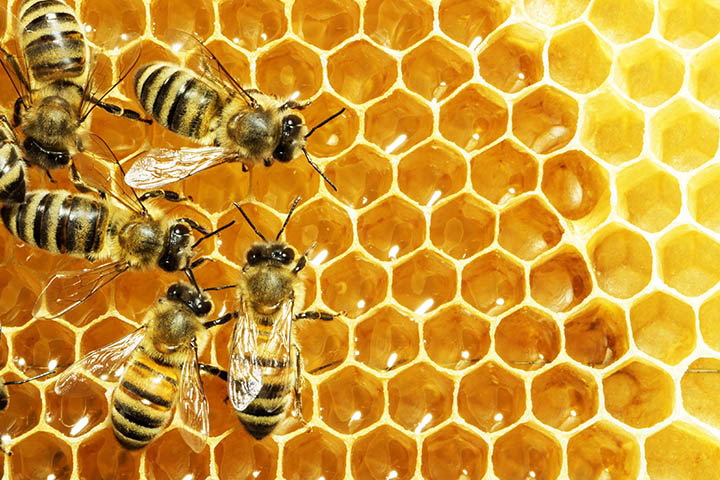

::: {.page-nav}

[Analysis](danl310proj.html){.btn .btn-outline-primary}
[Dashboard](honey-dashboard.html){.btn .btn-primary}

:::

# The State of American Honey
  Since the 1990s, the U.S. honey industry has shown an overall decline in domestic production, even though managed honey bees remain central to both honey markets and agricultural pollination. According to USDA data, U.S. honey production reached 116 million pounds in 2025, a 14% decrease from 2024, reflecting fewer producing colonies and lower yield per colony. This longer-term decline is likely driven by several interacting pressures, including Varroa destructor mites, viral disease, pesticide exposure, habitat loss, climate stress, and competition from imported honey. 
  
  The aim of this project is to analyze spatial and temporal trends in honey production over the years to see the extent to which this production crisis is impacting production levels. 
  
  This analysis can give insight into regional beekeeping pressure, colony health challenges, and broader risks to pollination-dependent agriculture. Additionally it could identify the most valuable regions to focus preservation efforts. 
  

  
# Data-Notes

## Dataset Context

Found on Kaggle.com, the dataset used in this project is honeyproduction, a cleaned and tidy dataset containing U.S. honey production data by state from **1998 to 2012**. The data were originally published by the National Agricultural Statistics Service, or NASS, which is part of the U.S. Department of Agriculture. NASS collects and reports agricultural statistics across many areas of U.S. agriculture, including honey production, honey bee colonies, and pollination-related data.

This dataset is useful for examining changes in the American honey industry during a period of growing concern about honey bee decline. In 2006, national attention increased around Colony Collapse Disorder, a phenomenon where worker bees disappear from hives and the remaining colony can no longer function. Although no single cause has been identified, possible contributing factors include hive diseases, parasites, pesticide exposure, habitat loss, and other environmental stressors. Because the dataset spans **1998–2012**, it allows comparison of honey production patterns before and after the rise of concern around Colony Collapse Disorder.

## Dataset Structure

```{r}
library(tidyverse)
honey_data <- read_csv("/Users/joshlefkowicz/Geneseo Courses/Data Analytics/Data 210/gitdocinclass/jlefkowiczdanl210pilot/danl210webpilot.github.io/honeyproduction.csv")

rmarkdown::paged_table(honey_data,
                       options = list(rows.print = 20,
                                      cols.print = 6,
                                      pages.print = 0,
                                      paged.print = F
                                      )) 
```


The main dataset used for this analysis is `honeyproduction.csv`. This file is the cleaned version of the original raw USDA/NASS honey production data and is arranged in a tidy format suitable for analysis and visualization.

Each row represents honey production information for a specific state and year. The dataset includes variables related to colony numbers, honey yield, total production, producer stocks, price, and total production value.

## Variables

`state`: The U.S. state abbreviation.

`year`: The year of observation. The dataset covers honey production from 1998 through 2012.

`numcol`: The number of honey-producing colonies. Honey-producing colonies are defined as the maximum number of colonies from which honey was taken during the year. Honey may have been taken from colonies that did not survive the entire year.

`yieldpercol`: Honey yield per colony, measured in pounds.

`totalprod`: Total honey production, calculated as `numcol * yieldpercol`. This variable is measured in pounds.

`stocks`: Honey stocks held by producers, measured in pounds.

`priceperlb`: Average price per pound of honey, based on expanded sales. This variable is measured in dollars.

`prodvalue`: Total value of honey production, calculated as `totalprod * priceperlb`. This variable is measured in dollars.

## Important Data Limitations

Some states are excluded from the dataset in certain years to avoid disclosing data for individual operations. For example, smaller-producing states such as Connecticut may not appear every year. Because of this, the dataset does not contain a perfectly complete state-by-year record for all U.S. states.

Due to rounding in the original USDA/NASS data, multiplying numcol by yieldpercol may not always exactly equal totalprod. Similarly, summing state-level values may not exactly match national-level production or value totals.

# Visualizations + Interpretations

```{r}
#| echo: false
library(tidyverse)
library(maps)
library(ggthemes)
library(scales)
library(ggrepel)

honey_gold <- "#D88400"
honey_yellow <- "#FFC400"
honey_dark <- "#3A2500"
honey_light <- "#FFF4CC"

theme_honey_light <- function(base_size = 14) {
  theme_minimal(base_size = base_size) +
    theme(
      plot.background = element_rect(fill = "white", color = NA),
      panel.background = element_rect(fill = "white", color = NA),
      panel.grid.major = element_line(color = "#E8D7A3", linewidth = 0.3),
      panel.grid.minor = element_blank(),
      plot.title = element_text(face = "bold", color = honey_dark, size = 20),
      plot.subtitle = element_text(color = "#6A4A00", size = 12),
      plot.caption = element_text(color = "#7A6500", size = 9, hjust = 0),
      axis.title = element_text(face = "bold", color = honey_dark),
      axis.text = element_text(color = honey_dark),
      legend.title = element_text(face = "bold", color = honey_dark),
      legend.text = element_text(color = honey_dark),
      strip.background = element_rect(fill = honey_light, color = NA),
      strip.text = element_text(face = "bold", color = honey_dark),
      legend.position = "right"
    )
}
```


## Average Honey Production by State


```{r}
df <- honey_data %>% 
  select(state, year, totalprod)

state_lookup <- tibble(
  abb = state.abb,
  region = str_to_lower(state.name)
)

df2 <- df %>%
  mutate(state = str_trim(str_to_upper(state))) %>%
  left_join(state_lookup, by = c("state" = "abb")) %>%
  group_by(region) %>%
  summarize(
    avg_totalprod = mean(totalprod, na.rm = TRUE),
    .groups = "drop"
  )

us_states <- map_data("state")

map_df <- us_states %>%
  left_join(df2, by = "region")

p_map <- ggplot(
  map_df,
  aes(x = long, y = lat, group = group, fill = avg_totalprod)
) +
  geom_polygon(color = "white", linewidth = 0.25) +
  coord_map(projection = "albers", lat0 = 39, lat1 = 45) +
  scale_fill_gradient(
    low = "#FFF8DC",
    high = honey_gold,
    name = "Average honey\nproduction",
    na.value = "gray92",
    labels = label_number(scale_cut = cut_short_scale())
  ) +
  labs(
    title = "Average Honey Production by State",
    subtitle = "Average total production across the full 1998–2012 timeframe",
    caption = "Data: honeyproduction.csv"
  ) +
  theme_map() +
  theme_honey_light() +
  theme(
    axis.text = element_blank(),
    axis.title = element_blank(),
    axis.ticks = element_blank(),
    panel.grid = element_blank(),
    legend.position = "right"
  )

p_map

```

**Interpretation:**  
Honey production is not evenly distributed across the United States. The darker gold states represent places with higher average production across the full time period, showing that the national honey industry is concentrated in a smaller set of major producing states rather than being spread evenly across all regions.

---

## National Honey Production Trends

```{r}
us_year <- honey_data %>%
  group_by(year) %>%
  summarize(
    totalprod = sum(totalprod, na.rm = TRUE),
    numcol = sum(numcol, na.rm = TRUE),
    yieldpercol = mean(yieldpercol, na.rm = TRUE),
    priceperlb = mean(priceperlb, na.rm = TRUE)
  ) %>%
  pivot_longer(
    cols = c(totalprod, numcol, yieldpercol, priceperlb),
    names_to = "metric",
    values_to = "value"
  ) %>%
  mutate(
    metric = factor(
      metric,
      levels = c("totalprod", "numcol", "yieldpercol", "priceperlb"),
      labels = c("Total production (lbs)",
                 "Number of colonies",
                 "Yield per colony (lbs)",
                 "Price per lb ($)")
    )
  )

p1 <- ggplot(us_year, aes(x = year, y = value)) +
  geom_point(size = 2.2, color = honey_gold) +
  geom_line(linewidth = 1, color = honey_dark) +
  geom_smooth(
    show.legend = FALSE,
    color = honey_gold,
    fill = honey_light,
    linewidth = 0.9
  ) +
  facet_wrap(~metric, scales = "free_y", ncol = 2) +
  scale_x_continuous(breaks = seq(1998, 2012, by = 2)) +
  scale_y_continuous(labels = label_number(scale_cut = cut_short_scale())) +
  labs(
    x = NULL,
    y = NULL,
    title = "U.S. Honey Production Trends, 1998–2012",
    subtitle = "Production, colonies, yield, and price move in different directions over time",
    caption = "Data: honeyproduction.csv"
  ) +
  theme_honey_light()

p1
```

**Interpretation:**  
This figure shows the broader national pattern behind the honey production story. Total production and yield per colony generally trend downward, while price per pound rises over time. That contrast suggests that honey became more valuable per pound as domestic production weakened, which may reflect increasing scarcity, higher production costs, or changing market conditions.

---

## States with the Largest Production Declines

```{r}
state_change <- honey_data %>%
  filter(year %in% c(1998, 2012)) %>%
  select(state, year, totalprod) %>%
  pivot_wider(names_from = year, values_from = totalprod, names_prefix = "year_") %>%
  mutate(change = year_2012 - year_1998) %>%
  slice_min(change, n = 10) %>%
  arrange(change)

state_change_long <- state_change %>%
  pivot_longer(
    cols = c(year_1998, year_2012),
    names_to = "year",
    values_to = "totalprod"
  ) %>%
  mutate(
    year = factor(year, levels = c("year_1998", "year_2012"),
                  labels = c("1998", "2012")),
    state = fct_inorder(state)
  )

p2 <- ggplot(state_change_long,
             aes(x = year, y = totalprod, group = state)) +
  geom_line(linewidth = 1.2, color = honey_gold) +
  geom_point(size = 3.4, color = honey_dark) +
  geom_text(
    data = state_change_long %>% filter(year == "1998"),
    aes(label = state),
    hjust = 1.2,
    size = 3.5,
    color = honey_dark,
    show.legend = FALSE
  ) +
  geom_text(
    data = state_change_long %>% filter(year == "2012"),
    aes(label = state),
    hjust = -0.2,
    size = 3.5,
    color = honey_dark,
    show.legend = FALSE
  ) +
  scale_y_continuous(labels = label_number(scale_cut = cut_short_scale())) +
  coord_cartesian(clip = "off") +
  labs(
    x = NULL,
    y = "Total production (lbs)",
    title = "Largest Production Declines",
    subtitle = "Comparing state production in 1998 and 2012",
    caption = "Data: honeyproduction.csv"
  ) +
  theme_honey_light() +
  theme(
    plot.margin = margin(10, 60, 10, 60),
    legend.position = "none"
  )

p2
```

**Interpretation:**  
This slope graph shows which states experienced the largest production drops between 1998 and 2012. The steepest downward lines represent states where production fell the most. This helps move the story from a national trend to specific state-level changes, showing that the overall decline was driven heavily by losses in certain major producing states.

---

## Production and Price Relationship

```{r}
price_prod <- honey_data %>%
  group_by(year) %>%
  summarize(
    totalprod = sum(totalprod, na.rm = TRUE),
    priceperlb = mean(priceperlb, na.rm = TRUE)
  )

p3 <- ggplot(price_prod,
             aes(x = totalprod, y = priceperlb, label = year)) +
  geom_point(alpha = 0.85, size = 3.2, color = honey_gold) +
  geom_text_repel(
    size = 3.2,
    box.padding = 0.35,
    max.overlaps = 20,
    color = honey_dark
  ) +
  geom_smooth(method = "lm", se = FALSE, color = honey_dark, linewidth = 1) +
  scale_x_continuous(labels = label_number(scale_cut = cut_short_scale())) +
  scale_y_continuous(labels = dollar_format()) +
  labs(
    x = "U.S. total production",
    y = "Average price per lb",
    title = "Annual U.S. Production Compared with Honey Price",
    subtitle = "Each point represents one year",
    caption = "Data: honeyproduction.csv"
  ) +
  theme_honey_light()

p3

```

**Interpretation:**  
This chart compares total U.S. production with average price per pound. The labeled years help show that lower production years often align with higher prices. This supports the idea that price is partly responding to supply conditions: when less honey is produced domestically, honey may become more valuable per pound.


## Production Heatmap for Major Producing States


```{r}
top_states <- honey_data %>%
  group_by(state) %>%
  summarize(mean_totalprod = mean(totalprod, na.rm = TRUE)) %>%
  slice_max(mean_totalprod, n = 15) %>%
  pull(state)

heat_df <- honey_data %>%
  filter(state %in% top_states) %>%
  group_by(state, year) %>%
  summarize(totalprod = mean(totalprod, na.rm = TRUE), .groups = "drop")

p4 <- ggplot(
  heat_df,
  aes(x = year,
      y = fct_reorder(state, totalprod, .fun = mean),
      fill = totalprod)
) +
  geom_tile(color = "white", linewidth = 0.45) +
  scale_fill_gradient(
    low = "#FFF8DC",
    high = honey_gold,
    labels = label_number(scale_cut = cut_short_scale())
  ) +
  guides(
    fill = guide_colorbar(
      barheight = unit(0.6, "cm"),
      barwidth = unit(8, "cm")
    )
  ) +
  scale_x_continuous(breaks = seq(1998, 2012, by = 2)) +
  labs(
    x = NULL,
    y = NULL,
    fill = "Production",
    title = "Production Intensity Across Top Honey-Producers",
    subtitle = "Darker gold cells indicate higher total production",
    caption = "Data: honeyproduction.csv"
  ) +
  theme_honey_light() +
  theme(
    panel.grid = element_blank(),
    legend.position = "bottom"
  )

p4
```


**Interpretation:**  
The heatmap shows how production intensity changes across the top honey-producing states. States with consistently darker cells are major contributors throughout the dataset, while lighter cells indicate lower production years. This figure is useful because it shows both time and geography in one view, making it easier to see which states stayed strong and which weakened.

---

## Top Producing States Compared with All Others

```{r}
top5_states <- honey_data %>%
  group_by(state) %>%
  summarize(mean_totalprod = mean(totalprod, na.rm = TRUE)) %>%
  slice_max(mean_totalprod, n = 5) %>%
  pull(state)

area_df <- honey_data %>%
  mutate(state_group = if_else(state %in% top5_states, state, "Other")) %>%
  group_by(year, state_group) %>%
  summarize(totalprod = sum(totalprod, na.rm = TRUE), .groups = "drop") %>%
  mutate(state_group = fct_relevel(state_group, "Other", after = Inf))

p5 <- ggplot(area_df,
             aes(x = year, y = totalprod, fill = state_group)) +
  geom_area(alpha = 0.92, color = "white", linewidth = 0.15) +
  scale_y_continuous(labels = label_number(scale_cut = cut_short_scale())) +
  scale_x_continuous(breaks = seq(1998, 2012, by = 2)) +
  scale_fill_manual(
    values = c(
      "Other" = "#FFE9A3",
      "CA" = "#8C510A",
      "FL" = "#BF812D",
      "ND" = "#D88400",
      "SD" = "#F6C344",
      "MT" = "#FFD966"
    )
  ) +
  labs(
    x = NULL,
    y = "Total production (lbs)",
    fill = "State",
    title = "Top 5 Producing States vs. All Other States",
    subtitle = "Stacked area chart showing how major producers contribute to national totals",
    caption = "Data: honeyproduction.csv"
  ) +
  theme_honey_light() +
  theme(
    legend.position = "top",
    panel.grid.minor = element_blank()
  )

p5
```

**Interpretation:**  
This stacked area chart shows how much of national production comes from the top producing states compared with all other states combined. The figure highlights that a small group of states plays an outsized role in U.S. honey production. When production changes in these states, the national trend can shift noticeably.
